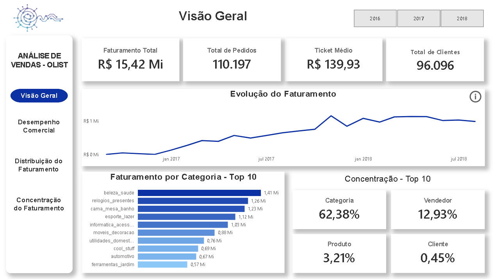

# Pipeline de Vendas

Este projeto apresenta uma análise de vendas baseada no dataset **Brazilian E-Commerce Public Dataset by Olist**, com foco na evolução do desempenho comercial, na distribuição do faturamento entre diferentes dimensões e no nível de concentração da receita.

# 1. Objetivo

Avaliar o desempenho comercial da Olist, analisando a evolução do faturamento e do volume de vendas, sua distribuição entre categorias, produtos, vendedores e regiões, e o nível de concentração do faturamento nesses elementos.

# Dashboard



[Baixar e visualizar o dashboard](https://drive.google.com/drive/folders/1-E8JKK3i9kc2Int4LL_X0gdiYMvc1fzh?usp=drive_link)

# 2. Perguntas de Negócio

1. Como o desempenho comercial evolui ao longo do período?
2. Quais categorias de produtos e regiões mais contribuem para o faturamento?
3. O faturamento está concentrado em poucos elementos?

## 3. Dados

Os dados utilizados neste projeto são provenientes do dataset **Brazilian E-Commerce Public Dataset by Olist**, disponibilizado no Kaggle. O conjunto contém informações sobre pedidos realizados na plataforma de e-commerce da Olist, incluindo clientes, pedidos, itens, produtos e vendedores, abrangendo o período de setembro de 2016 a outubro de 2018.

### Arquivos utilizados

| Arquivo                         | Descrição                                    |
| ------------------------------- | -------------------------------------------- |
| `olist_customers_dataset.csv`   | Informações dos clientes e sua localização   |
| `olist_orders_dataset.csv`      | Informações dos pedidos e seus status        |
| `olist_order_items_dataset.csv` | Itens dos pedidos, preços e valores de frete |
| `olist_products_dataset.csv`    | Informações dos produtos e suas categorias   |
| `olist_sellers_dataset.csv`     | Informações dos vendedores e sua localização |

Os arquivos foram utilizados como dados brutos do pipeline, passando posteriormente pelas etapas de limpeza, transformação, modelagem e carregamento em um banco de dados SQLite.

### Fonte dos dados

[Brazilian E-Commerce Public Dataset by Olist](https://www.kaggle.com/datasets/olistbr/brazilian-ecommerce)

## 4. Metodologia

O projeto foi desenvolvido seguindo um fluxo de dados estruturado em etapas, desde a extração dos dados brutos até a disponibilização dos resultados para análise.

### 4.1 Preparação dos dados

Os dados foram inicialmente disponibilizados em arquivos CSV e preparados utilizando **Python e Pandas**, passando pelas etapas de extração, limpeza, transformação e modelagem.

* Extração dos arquivos brutos para os DataFrames;
* Seleção e remoção de colunas não utilizadas na análise;
* Padronização dos dados e dos tipos de dados;
* Integração das diferentes fontes por meio de relacionamentos entre as tabelas;
* Criação de colunas derivadas, como o valor total dos itens;
* Criação de uma dimensão de datas;
* Organização dos dados em um modelo dimensional.

### 4.2 Armazenamento

Após o processamento, os dados transformados foram armazenados utilizando **Python e SQLite**, sendo disponibilizados em diferentes formatos para utilização nas etapas seguintes.

* Exportação dos dados processados para arquivos CSV;
* Criação e estruturação das tabelas em um banco de dados SQLite;
* Carregamento dos dados processados no banco de dados.

### 4.3 Análise

Com os dados estruturados no banco, foram realizadas **consultas SQL** para responder às perguntas de negócio definidas no projeto.

* Análise da evolução do faturamento e do volume de pedidos;
* Comparação do desempenho entre períodos;
* Análise da distribuição do faturamento por categorias e regiões;
* Análise da concentração do faturamento entre categorias, vendedores, produtos e clientes.

### 4.4 Visualização

Os resultados das análises foram apresentados em um **dashboard interativo desenvolvido no Power BI**, utilizando **medidas em DAX**, indicadores, gráficos e filtros.

* Organização das análises em páginas de acordo com as perguntas de negócio;
* Criação de medidas em DAX para os principais indicadores e análises;
* Desenvolvimento de visualizações para facilitar a exploração dos resultados;
* Criação de uma página de visão geral para sintetizar os principais resultados.

## 5. Arquitetura e Pipeline

O pipeline foi estruturado em etapas sequenciais, com o objetivo de transformar os dados brutos em informações estruturadas para análise.

**Fluxo do projeto:**

`Dados brutos -> Extração -> Limpeza -> Transformação e modelagem -> Validação -> Carregamento -> Análise SQL -> Power BI`

### Etapas

* **Extração:** leitura dos arquivos CSV armazenados em `data/raw/`;
* **Limpeza:** seleção, remoção e tratamento dos dados utilizados no projeto;
* **Transformação e modelagem:** criação de colunas derivadas, dimensão de datas e estruturação das tabelas conforme o modelo definido;
* **Validação:** verificação da estrutura e consistência dos dados processados;
* **Carregamento:** armazenamento dos dados processados em arquivos CSV e no banco de dados SQLite;
* **Análise:** execução das consultas SQL para responder às perguntas de negócio;
* **Visualização:** utilização dos resultados no Power BI para construção do dashboard.

## 6. Ferramentas

* Python
* Pandas
* SQLite
* SQL
* Power BI
* DAX
* Git e GitHub

## 7. Resultados e Insights

### 7.1 Desempenho Comercial

* **2016** apresentou o menor faturamento devido à baixa cobertura temporal, com apenas **267 pedidos entregues**.
* **2018** apresentou o maior faturamento e volume de pedidos, mesmo com dados disponíveis apenas até agosto.
* Na comparação de **janeiro a agosto**, o faturamento de 2018 foi **143,36% maior** que o de 2017, uma diferença de aproximadamente **R$ 4,9 milhões**.
* O volume de pedidos apresentou uma diferença expressiva entre os períodos, enquanto o **ticket médio permaneceu relativamente próximo**.
* Os resultados indicam que o **aumento no volume de pedidos foi o principal fator associado ao crescimento do faturamento** entre os períodos analisados.
* A evolução mensal apresentou **oscilações ao longo do período**, sem um padrão contínuo de crescimento.

### 7.2 Distribuição do Faturamento

* **São Paulo** foi o principal contribuinte para o faturamento, tanto em nível estadual quanto municipal, acompanhado pelo maior volume de vendedores, clientes e itens vendidos.
* O destaque de São Paulo está associado principalmente à **escala da operação**, e não ao maior faturamento médio por vendedor ou cliente.
* A categoria **Beleza e Saúde** apresentou o maior faturamento, com aproximadamente **R$ 1,4 milhão**, combinando alto volume de itens vendidos com um valor médio por item intermediário.
* A categoria **Relógios e Presentes** apresentou o segundo maior faturamento, mesmo com um volume menor de itens, devido ao seu maior valor médio por item.
* A categoria **Cama, Mesa e Banho** apresentou alto volume de itens vendidos, mas um valor médio por item inferior, mostrando que volume e valor médio podem contribuir de formas diferentes para o faturamento.

### 7.3 Concentração do Faturamento

* Entre as **74 categorias**, o Top 5 concentra **39,26%** do faturamento, o Top 10 **62,40%** e o Top 20 **83,95%**. Apenas as três maiores categorias representam **25,31%** do faturamento.
* Entre os **93.358 clientes**, o Top 5 representa apenas **0,35%** do faturamento, enquanto o Top 20 representa **2,49%**, indicando baixa concentração entre clientes.
* Entre os **32.216 produtos**, o Top 5 representa **2,14%** e o Top 20 **5,41%** do faturamento, também indicando baixa concentração.
* Entre os **2.970 vendedores**, o Top 5 concentra **7,44%**, o Top 10 **12,93%** e o Top 20 **21,05%** do faturamento. O maior vendedor individual representa **1,60%**.

Os resultados indicam **alta concentração do faturamento entre categorias**, enquanto clientes e produtos apresentam baixa concentração. Entre os vendedores, existe uma concentração maior que a observada em clientes e produtos, mas sem predominância de um único vendedor.

## 8. Limitações

* Os dados de **2018 estão disponíveis apenas até agosto**, o que limita comparações com anos completos.
* **2016 possui baixa cobertura temporal**, com registros concentrados em poucos dias, tornando comparações com os demais anos pouco representativas.
* Os produtos são identificados apenas por **IDs**, sem nomes ou descrições, limitando a interpretação de análises individuais por produto.
* A análise de concentração considera o **faturamento bruto dos itens**, incluindo o valor do frete, conforme definido no projeto.

## 9. Conclusão

A análise permitiu avaliar a evolução do desempenho comercial da Olist, identificando o crescimento do faturamento e do volume de pedidos ao longo do período analisado.

Os resultados também evidenciaram diferenças na contribuição entre categorias e regiões, com destaque para a participação de São Paulo e para a categoria Beleza e Saúde. A análise de concentração mostrou ainda que o faturamento está fortemente concentrado entre poucas categorias, enquanto apresenta uma distribuição mais ampla entre clientes e produtos.

Além da análise dos dados, o projeto possibilitou a construção de um fluxo completo de dados, desde a extração e transformação dos arquivos brutos até o armazenamento em SQLite, análise com SQL e apresentação dos resultados em um dashboard no Power BI.

## 10. Dashboard

O dashboard foi desenvolvido no **Power BI** e organizado em quatro páginas, cada uma com um objetivo específico:

* **Visão Geral:** síntese dos principais indicadores e resultados do projeto.
* **Desempenho Comercial:** análise da evolução do faturamento e do volume de pedidos.
* **Distribuição do Faturamento:** análise da contribuição de categorias e regiões.
* **Concentração do Faturamento:** análise da concentração da receita entre categorias, vendedores, produtos e clientes.

O arquivo `.pbix` está disponível para [download](https://drive.google.com/drive/folders/1-E8JKK3i9kc2Int4LL_X0gdiYMvc1fzh?usp=drive_link).

## 11. Estrutura do Projeto

```text
Pipeline_de_Vendas/
├── data/
│   ├── raw/
│   │   ├── olist_customers_dataset.csv
│   │   ├── olist_orders_dataset.csv
│   │   ├── olist_order_items_dataset.csv
│   │   ├── olist_products_dataset.csv
│   │   └── olist_sellers_dataset.csv
│   ├── processed/
│   │   ├── customers.csv
│   │   ├── orders.csv
│   │   ├── order_items.csv
│   │   ├── products.csv
│   │   └── sellers.csv
│   └── database/
│       └── sales.db
├── notebooks/
│   ├── 01_initial_exploration.ipynb
│   ├── 02_cleaning_and_preprocessing.ipynb
│   └── 03_transformation_and_modeling.ipynb
├── reports/
│   └── images/
│       ├── Concetracao_faturamento.png
│       ├── Desempenho_comercial.png
│       ├── Distribuicao_faturamento.png
│       ├── Modelo_Logico_Final.jpeg
│       ├── Modelo_Logico_Inicial.jpeg
│       └── Visao_geral.png
├── sql/
│   ├── 00_create_tables.sql
│   ├── 01_commercial_performance.sql
│   ├── 02_revenue_by_category_and_region.sql
│   └── 03_revenue_concentration.sql
├── src/
│   └── pipeline_vendas/
│       ├── __init__.py
│       ├── cleaning.py
│       ├── extract.py
│       ├── load.py
│       ├── transform.py
│       └── validation.py
├── .gitignore
├── pyproject.toml
└── README.md
```

## 12. Como Executar

### 1. Clone o repositório

```bash
git clone https://github.com/CarlosAlexandreOM/Pipeline_de_Vendas.git
cd Pipeline_de_Vendas
```

### 2. Instale as dependências

O projeto utiliza `pyproject.toml` para gerenciamento das dependências.

```bash
pip install .
```

### 3. Baixe os arquivos do projeto

Os arquivos necessários para execução do projeto estão disponíveis no [Google Drive](https://drive.google.com/drive/folders/1-E8JKK3i9kc2Int4LL_X0gdiYMvc1fzh?usp=drive_link).

### 4. Execute o pipeline

Execute as etapas de extração, limpeza, transformação, validação e carregamento conforme a estrutura definida no projeto.

Os dados processados serão armazenados em `data/processed/` e o banco de dados SQLite em `data/database/`.